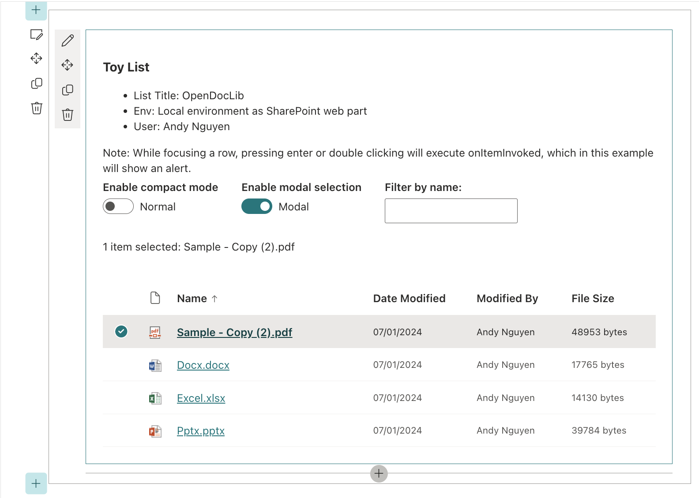

# spfx-122-fluentui-webpart

## Summary

Sample SPFX 1.22 webpart using FluentUI, React TypeScript, PnPJs, PnPGraph.



## Used SharePoint Framework Version


## Minimal Path to Awesome

- Clone this repository
- Ensure that you are at the solution folder
- in the command-line run:
  - `npm install -g @rushstack/heft`
  - `npm install`
  - `heft start`

## From scratch
- Install and use node 22:
```
nvm install 22
nvm alias default 22
```

- Install SharePoint Framework ToolKit VS Code extension
- Install Yeoman and related
```
npm install -g yo
npm install -g @rushstack/heft
npm install -g @microsoft/generator-sharepoint@1.22.0
```
- Use SPFX VS Code extension to create new SPFX WebPart with all the options
- Also on the extension UI after created, run those common tasks: 
  - Trust self-signed dev cert (`heft trust-dev-cert`)
  - Test (`heft test`)
  - Start (`heft start`)

## Deployment
- Build solution package
```
npm run package
```
- Upload to App Catalogs
- Publish to SharePoint and Teams

## Update Fluent UI React
```
npm install @fluentui/react@latest
npm install @fluentui/react@8.125.3
```

## Install PnP
```
npm install @pnp/sp@4.17.0 @pnp/graph@4.17.0 @pnp/queryable@4.17.0
```

## Jest
### Install
```
npm install --save-dev jest ts-jest @types/jest
npx ts-jest config:init
```
### Run
```
npx jest
npx jest --watch
npx jest --verbose
```

